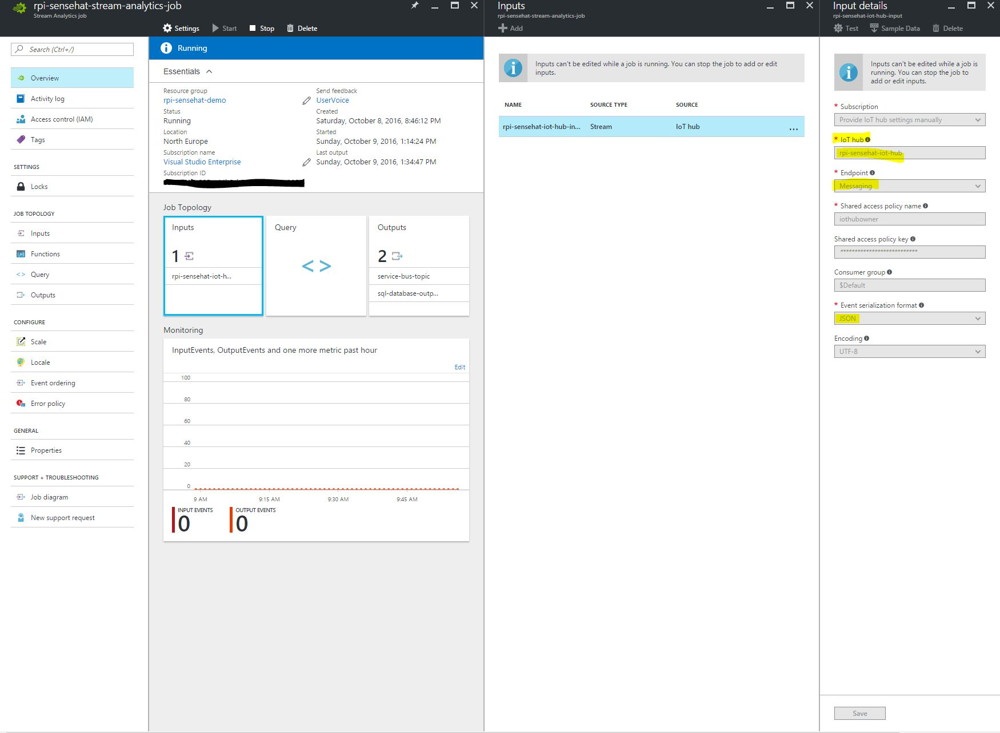
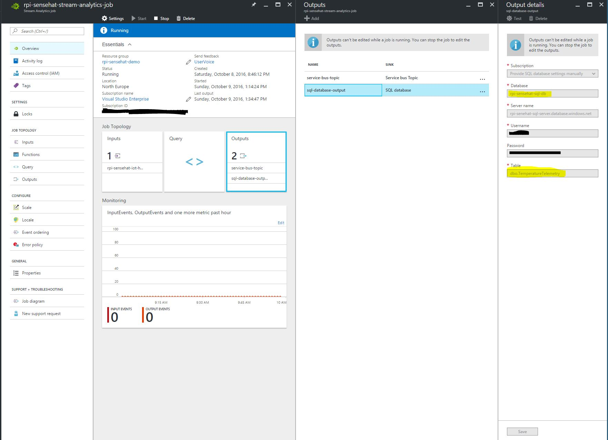

Sending data from IoT Hub to Stream Analytics
=============================================

What is Stream Analytics
------------------------

> Azure Stream Analytics is a fully managed, cost effective real-time event processing engine that helps to unlock deep insights from data. Stream Analytics makes it easy to set up real-time analytic computations on data streaming from devices, sensors, web sites, social media, applications, infrastructure systems, and more.

> With a few clicks in the Azure portal, you can author a Stream Analytics job specifying the input source of the streaming data, the output sink for the results of your job, and a data transformation expressed in a SQL-like language. You can monitor and adjust the scale/speed of your job in the Azure portal to scale from a few kilobytes to a gigabyte or more of events processed per second.+

> More on the [Official Microsoft Documentation](https://docs.microsoft.com/en-us/azure/stream-analytics/stream-analytics-introduction)

Here you can find a [full IoT Solution with Azure Stream Analytics](https://docs.microsoft.com/en-us/azure/stream-analytics/stream-analytics-build-an-iot-solution-using-stream-analytics)

Sending data from IoT Hub to Stream Analytics
---------------------------------------------

Right now we have data from the Raspberry Pi going to the IoT Hub, but nothing more happens with that data. First, we will send it through an Azure SQL Database.

> [Follow this tutorial in order to create an Azure SQL Database](https://docs.microsoft.com/en-us/azure/sql-database/sql-database-get-started).

After creating the Stream Analytics service in Azure, we need to add input data, in this case from the IoT Hub:



We also need to configure an output, an Azure SQL database: 



Notice how we also need to configure a table for our data to be stored. This table should have the same structure as our `TemperatureTelemetry` objects that we send.

This is the script I used for creating the table for the temperature telemetry:

```
CREATE TABLE [dbo].[TemperatureTelemetry] (
    [Time]        DATETIME   NULL,
    [Temperature] FLOAT (53) NOT NULL
);
```

At this point, we need a Stream Analytics query that takes the data from IoT Hub and puts it into our SQL database:

```
SELECT
    Time, Temperature
INTO
    [sql-database-output]
FROM
    [rpi-sensehat-iot-hub-input]
```

> The names `sql-database-output` and `rpi-sensehat-iot-hub-input` are the names I gave the SQL database as output and the IoT Hub as input, respectively.


