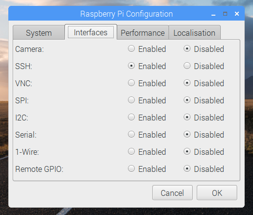

Session 1 - Getting your development environment ready
======================================================

In this session we will go through the process of installing Raspbian on a Raspberry Pi 3.

To get started, go at [this page that show the installation guide](https://www.raspberrypi.org/documentation/installation/installing-images/README.md) in order to setup your device.

First [download the Raspbian official image from the Downloads page](https://www.raspberrypi.org/downloads/raspbian/), then check out how to write the image to the SD card based on your computer operating system:

- [Linux](https://www.raspberrypi.org/documentation/installation/installing-images/linux.md)
- [macOS](https://www.raspberrypi.org/documentation/installation/installing-images/mac.md)
- [Windows](https://www.raspberrypi.org/documentation/installation/installing-images/windows.md)

> For this workshop we provide a keyboard, mouse and monitor, so that you can first configure the Raspberry using the GUI, but you can also do it without one.

Find out the IP Address of the Raspberry
----------------------------------------

> Any device connected to a Local Area Network is assigned an IP address.

> In order to connect to your Raspberry Pi from another machine using SSH or VNC, you need to know the Pi's IP address. This is easy if you have a display connected, and there are a number of methods for finding it remotely from another machine on the network.

Using the Raspberry with a display
----------------------------------

Open a terminal and simply type `hostname -I`. This will reveal your Pi's IP address.

Using the Raspberry without a display (headless)
------------------------------------------------

If you have access to your router, then go to the device list and simply check the IP of the Raspberry.

Otherwise, you will have to use the [NMAP](https://nmap.org/download.html) command (Network Mapper).

> On Linux simply execute `apt-get install nmap` to install nmap.
> On Windows and macOS go to the [NMAP downloads page](https://nmap.org/download.html).

To use nmap to scan the devices on your network, you need to know the subnet you are connected to. First find your own IP address, in other words the one of the computer you're using to find your Pi's IP address:

> On Linux, type hostname -I into a terminal window
> On Mac OS, go to System Preferences then Network and select your active network connection to view the IP address
> On Windows, go to the Control Panel, then under  Network and Sharing Center, click View network connections, select your active network connection and click  View status of this connection to view the IP address

Now you have the IP address of your computer, you will scan the whole subnet for other devices. For example, if your IP address is `192.168.1.5`, other devices will be at addresses like `192.168.1.2`, `192.168.1.3`, `192.168.1.4`, etc. The notation of this subnet range is `192.168.1.0/24` (this covers `192.168.1.0` to  `192.168.1.255`).

Now use the `nmap` command with the `-sn` flag (ping scan) on the whole subnet range. This may take a few seconds:

```
nmap -sn 192.168.1.0/24
Ping scan just pings all the IP addresses to see if they respond. For each device that responds to the ping, the output shows the hostname and IP address like so:

Starting Nmap 6.40 ( http://nmap.org ) at 2014-03-10 12:46 GMT
Nmap scan report for hpprinter (192.168.1.2)
Host is up (0.00044s latency).
Nmap scan report for Gordons-MBP (192.168.1.4)
Host is up (0.0010s latency).
Nmap scan report for ubuntu (192.168.1.5)
Host is up (0.0010s latency).
Nmap scan report for raspberrypi (192.168.1.8)
Host is up (0.0030s latency).
Nmap done: 256 IP addresses (4 hosts up) scanned in 2.41 seconds
```
Here you can see a device with hostname raspberrypi has IP address  192.168.1.8.


Alternatively, you can use the `arp` command: 

- on a Windows computer, start a new PowerShell session and execute the following command: arp -a | sls b8-27-eb or `arp -a | Select-String b8-27-eb
- on a Linux or Mac computer, start a new Bash session and execute the following command: arp -a | grep "b8:27:eb"

In both cases, the command will execute the `arp -a` command will display all network entries for all network interfaces. The sls/Select-String and grep will search the output of the arp command for the specific MAC address of all Raspberry Pi boards that starts with B8:27:EB. Running this command will allow you to see the IP of your board without attaching it to a display.

Connecting via SSH
------------------

> You can access the command line of a Raspberry Pi remotely from another computer or device on the same network using SSH.

Note that using SSH you only have access to the command line of the Raspberry and not the full desktop. [For full remote desktop, see VNC](https://www.raspberrypi.org/documentation/remote-access/vnc/README.md).

On Linux and macOS, open a terminal and execute the following command: `ssh pi@<raspberry-ip>`, where `<raspberry-ip>` is the IP of the Raspberry you determined above.

The default user for Raspbian is `pi` and the default password is `raspberry`.

On Windows you will have to either use [Bash on Windows](https://msdn.microsoft.com/en-us/commandline/wsl/install_guide) or [PuttY](http://the.earth.li/~sgtatham/putty/latest/x86/putty.exe)

Enable SSH on the Raspberry
----------------------------

As of the November 2016 release of Raspbian, the SSH server is disabled by default to prevent attacks. You can enable it using the terminal: 

Enter `sudo raspi-config` in the terminal, first select `Interfacing options`, then navigate to `ssh`, press Enter and select  `Enable or disable ssh server`.

Alternatively, you can enable SSH through the GUI:

