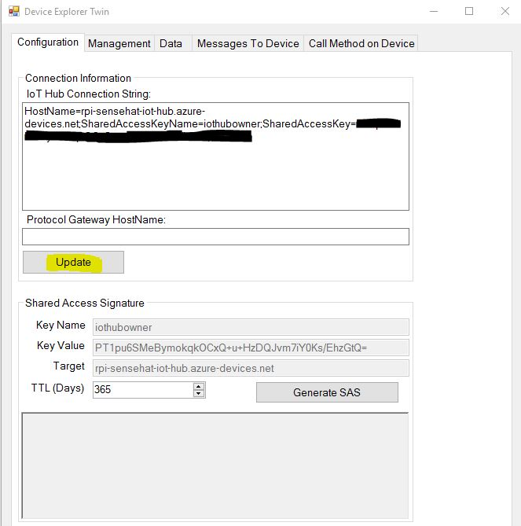

Session 3 - Sending Device-to-Cloud messages
============================================

In this session we will start building an application that sends data to an Azure IoT Hub.

Creating an Azure IoT Hub
--------------------------

First of all, you need to create an Azure IoT Hub. In order to do this, [follow this detailed step-by-step tutorial](../../common/azure-iot-hub.md).

After you created the IoT Hub, should see something similar to this:

Installing the Device Explorer
------------------------------

[Device Explorer](https://github.com/Azure/azure-iot-sdks/releases/download/2016-11-17/SetupDeviceExplorer.msi) is a small application that allows the management and monitoring of the devices connected to an Azure IoT Hub.

After installing the application, start it, paste the **Connection string - primary key** in the connection string field from the **Configuration** tab and press the **Update** button.

Then, in the **Management** tab click **Create** button to create a new device identity. Provide a device id or name, optionally modify the primary and secondary key and click **Create**. 

At this point, we can copy the **Connection string** that was created for our device and use it later in our application.

Unless we have this connection string that is associated with our IoT Hub instance, we will not be able to send data to the IoT Hub.

